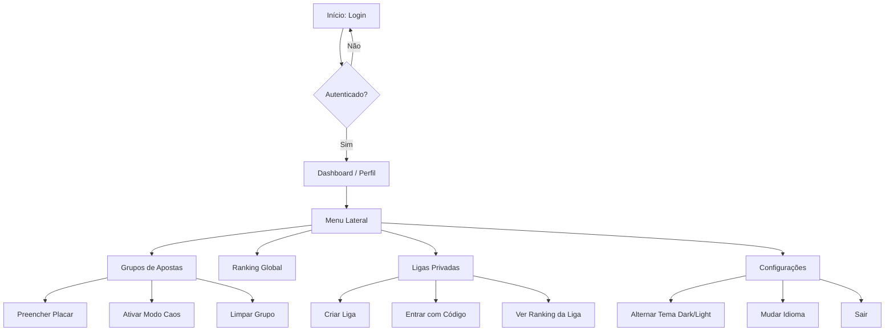

# Documento de Casos de Uso - Make Bolão Great Again

Este documento detalha as funcionalidades e a jornada do usuário dentro do sistema Make Bolão Great Again. Ele serve como base técnica e funcional para a criação do Manual do Usuário.

---

## 1. Visão Geral da Jornada do Usuário

Abaixo, o fluxo principal que um usuário percorre desde o acesso inicial até a gestão de suas apostas e consulta de ranking.

---

## 2. Detalhamento por Tela

### 2.1 Tela de Login
*   **Objetivo:** Autenticar o usuário para garantir a persistência de suas apostas.
*   **Elementos e Ações:**
    *   **Campo de Email:** Inserção do endereço de email cadastrado.
    *   **Campo de Senha:** Inserção da senha secreta.
    *   **Botão "Entrar":** Valida as credenciais via Supabase.
    *   **Recuperação/Cadastro:** Link para usuários novos ou que esqueceram a senha.
*   **Efeito:** Redireciona para o Dashboard (Perfil) após sucesso.

### 2.2 Dashboard (Meu Perfil)
*   **Objetivo:** Centralizar o progresso do usuário e suas estatísticas de acerto.
*   **Visualização:**
    *   **Avatar:** Letra inicial do nome do usuário em um círculo estilizado.
    *   **Progresso de Apostas:** Barra de progresso mostrando quantos jogos (ex: 32/72) já possuem palpite.
    *   **Cartão de Pontos:** Exibe a pontuação total acumulada.
    *   **Estatísticas:**
        *   **Acertos Exatos (🎯):** Jogos onde o usuário acertou o placar cheio (vale 3 pontos).
        *   **Acertos de Resultado (✅):** Jogos onde o usuário acertou apenas o vencedor/empate (vale 1 ponto).
*   **Ação:** Deslizar para baixo (Pull-to-refresh) para atualizar os dados.

### 2.3 Tela de Grupos (Apostas)
*   **Objetivo:** Onde a interação principal ocorre. O usuário define seus palpites para os jogos da fase de grupos.
*   **Ações Principais:**
    1.  **Digitar Placar:** Clique em um dos quadrados de pontuação (Home/Away) para abrir o teclado numérico.
    2.  **Modo Caos (Switch Superior Direito):** 
        *   Ao ligar, as bandeiras dos times e o "X" de empate tornam-se botões.
        *   Clique na **Bandeira**: Gera um placar de vitória aleatório para aquele time.
        *   Clique no **"X"**: Gera um empate aleatório.
    3.  **Menu de Dados (🎲):**
        *   *Aleatorizar Tudo:* Preenche todos os jogos vazios do grupo com placares aleatórios.
        *   *Seguir Classificação:* O usuário define a ordem final que deseja para o grupo (ex: 1º Brasil, 2º França), e o sistema gera placares que resultem exatamente naquela tabela.
    4.  **Limpar Grupo (Lixeira Vermelha):** Apaga todas as apostas do grupo atual após confirmação.
*   **Tabela de Classificação:** Abaixo do cabeçalho, uma tabela dinâmica mostra como o grupo ficaria baseado *apenas* nos seus palpites.

### 2.4 Ranking Global
*   **Objetivo:** Comparação de performance entre todos os participantes do sistema.
*   **Funcionalidades:**
    *   **Top 3 Especial:** Destaque visual (Ouro, Prata, Bronze) para os líderes.
    *   **Destaque do Usuário:** Sua posição no ranking é destacada com uma cor diferente para fácil localização.
    *   **Dados:** Mostra Pontuação, Nome e Total de Apostas realizadas por cada pessoa.

### 2.5 Ligas Privadas
*   **Objetivo:** Criar mini-competições entre amigos, colegas de trabalho, etc.
*   **Jornada de Uso:**
    1.  **Criar Liga:** Define um nome e o sistema gera um **Código de Convite** único de 6 caracteres.
    2.  **Entrar em Liga:** Insere o código recebido de um amigo para passar a fazer parte do ranking daquele grupo.
    3.  **Copiar Código:** Botão de atalho para enviar o código para outras pessoas.
    4.  **Visualizar:** Ao expandir o card da liga, o usuário vê o ranking específico apenas dos membros daquela liga.

### 2.6 Configurações
*   **Objetivo:** Personalização da experiência de uso.
*   **Opções:**
    *   **Tema:** Alternância entre Modo Claro (Light) e Modo Escuro (Dark).
    *   **Idioma:** Suporte completo para Português, Inglês e Italiano (traduções de interface e nomes de times).
    *   **Logout:** Encerramento seguro da sessão.

---

## 3. Fluxo Administrativo (Admin Only)
*   **Objetivo:** Gestão dos dados oficiais da Copa.
*   **Ações:**
    1.  **Sincronizar (Botão Flutuante):** Busca os resultados oficiais de uma planilha mestre (Excel/Google Sheets) e atualiza o banco de dados.
    2.  **Override Manual:** O administrador pode clicar em qualquer jogo e alterar manualmente o placar real e o status (Scheduled, Live, Finished).
    3.  **Cálculo de Pontos:** Ao marcar um jogo como "Finished", o sistema automaticamente recalcula os pontos de todos os usuários baseados nos palpites salvos.
